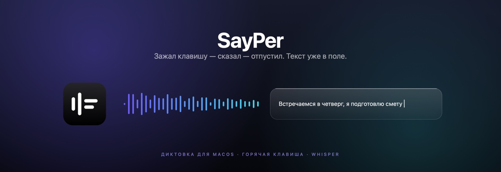
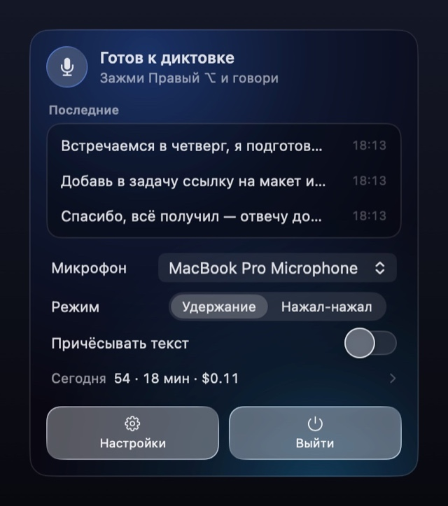
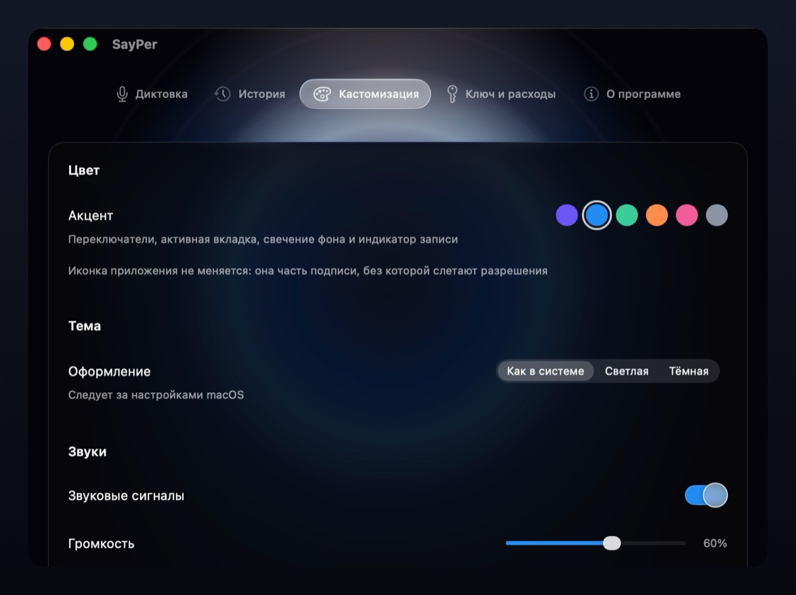

<div align="center">



**English** · [Русский](README.ru.md)

**Hold a key, speak, release — the text lands wherever your cursor is.**

A menu-bar dictation app for macOS. It records your voice, sends it to OpenAI Whisper,
and inserts the result into whatever app you were typing in. No window, no Dock icon.

[](https://github.com/grisha123invent-official/SayPer/releases/latest)
&nbsp;

&nbsp;

&nbsp;
[](LICENSE)

</div>

> [!NOTE]
> **The interface is in Russian only.** Every label, menu and prompt inside the app is Russian;
> an English localisation isn't done yet. Transcription itself works in any language Whisper supports.

---

## How it works

<table>
<tr>
<td width="33%" valign="top">

### 1. Hold

Press and hold your hotkey — any combination, bare modifiers included. A pill appears
on screen and its bars move with your voice, so you can see the mic is hearing you.

</td>
<td width="33%" valign="top">

### 2. Speak

Talk normally. System audio is quietened while you record, so music doesn't leak
into the microphone and spoil the transcription.

</td>
<td width="33%" valign="top">

### 3. Release

The text appears where your cursor was. Keep dictating straight away — phrases are
transcribed in parallel but inserted in the order you said them.

</td>
</tr>
</table>

<div align="center">

</div>

---

## What it looks like

<table>
<tr>
<td width="50%" valign="top" align="center">



**The panel.** Last transcriptions, microphone, mode, today's spending —
one click from the menu bar.

</td>
<td width="50%" valign="top" align="center">


**Dictation.** Hotkey, hold or press-to-toggle, which microphone.
The rare stuff is folded away under «Ещё».

</td>
</tr>
<tr>
<td width="50%" valign="top" align="center">


**Spending.** What you've actually spent with OpenAI, by day and by model.
No surprises at the end of the month.

</td>
<td width="50%" valign="top" align="center">



**Appearance.** Six accent colours, light/dark/system theme,
per-event sounds with a volume slider.

</td>
</tr>
</table>

---

## Requirements

|  |  |
|---|---|
| **macOS 26 or later** | Built against the macOS 26 SDK and uses APIs that don't exist on earlier versions. |
| **Apple Silicon** | The build is arm64 only; Intel Macs are not supported. |
| **Your own OpenAI key** | About **$0.006 per minute** of speech — roughly 36 cents per hour of dictation — billed by OpenAI directly to you. |

## Install

Download from [Releases](https://github.com/grisha123invent-official/SayPer/releases).
Either file works — the `.dmg` is prettier, the `.zip` is smaller and gets blocked one time fewer.

The app is signed but **not notarised by Apple** (notarisation needs a paid Developer Program
membership), so macOS quarantines the download and refuses to open it. There are two ways past that.


### One command, then everything just works

1. Open **Terminal** (⌘Space, type "Terminal").
2. Type this, **including the trailing space**, but don't press Enter yet:

   ```
   xattr -d com.apple.quarantine 
   ```

3. **Drag the downloaded file from Finder straight into the Terminal window.** Its full path appears
   by itself — it doesn't matter where the file is or what it's called. This is the point of dragging:
   if you downloaded twice, macOS named the second copy `SayPer-1.0 2.dmg`, and typing that by hand
   is asking for trouble.
4. Press **Enter**.

Now open the image, drag SayPer into Applications and launch it — no warnings at all. Clearing the
quarantine on the image clears it for the app inside too, so the security dialog never appears.

Same for the zip: clear it first, then unzip. Unzipping first and clearing after also works, just
point the command at the app instead.

**Already dragged the app into Applications and got blocked?** Then clear it on the app itself —
`-r` because an app is a folder:

```bash
xattr -dr com.apple.quarantine /Applications/SayPer.app
```

**"No such xattr" in response?** That means there was no quarantine on that file — nothing to do,
just open it.

<details>
<summary><b>Without Terminal</b></summary>

<br>

1. Double-click the download. macOS says it "could not verify" the file — click **Done**,
   not "Move to Trash".
2. Open **System Settings → Privacy & Security**, scroll to the bottom. There's a line about the
   blocked file and an **Open Anyway** button. Click it and confirm.
3. The image opens. **Drag SayPer into Applications** — don't run it from the image or from
   Downloads: macOS launches apps in those places from a read-only random folder, and the
   permissions you grant won't survive a restart.
4. Launch the app. **It will be blocked a second time** — the app inherits the quarantine from the
   image. Repeat step 2 for the app itself.

The zip route skips one of those rounds: extract, drag into Applications, and you only get blocked
once — on the app.

Control-clicking and choosing "Open" no longer works; Apple removed that shortcut in recent macOS
versions.

</details>

## First run

A short wizard walks through everything it needs:

- **Microphone** — nothing to record without it.
- **Accessibility** and **Input Monitoring** — two separate permissions, both required. The first
  lets the app paste text into other apps; the second lets it see your hotkey while you're working
  elsewhere. macOS doesn't let an app grant these to itself, so you flip the switches in System
  Settings — and the wizard notices the moment you do. No restart, no "I've done it" button.
- **OpenAI key** — create one at [platform.openai.com](https://platform.openai.com/api-keys).
  It's shown once, so copy it right away.

## Everyday use

- **Esc** cancels — an ongoing recording, or a transcription you've stopped waiting for.
- Don't like holding the key? Switch to **press-to-start, press-to-stop**.
- Any combination works, including bare modifiers. Left and right keys are told apart.
- If your hotkey is modifiers only, pressing a regular key during a recording cancels it — so your
  normal shortcuts keep working.
- Two microphones, two hotkeys: one for the built-in mic, another for your headset. Whichever you
  hold picks the device.

## What else it does

- **Nothing gets lost.** A recording lives on disk until its text has actually been delivered.
  If the app restarts mid-phrase, it picks the recording up on the next launch, transcribes it
  and files it in the history.
- **You can see it working.** Every phrase still in flight has its own row in the panel —
  *transcribing*, *connection dropped, retrying (2 of 3)*, *didn't get through*.
- **History** of everything transcribed, kept locally. Copy or re-insert any entry.
- **Audio ducking** — system audio is quietened while recording, then restored.
- **Vocabulary** — names and terms you feed it get recognised more reliably.
- **Cleanup** — an optional second pass that fixes punctuation and strips filler words.
- **A built-in helper** — ask it about the app in plain words. It knows the app *and* your current
  settings, and where the answer is a setting, it offers a button. You press it, not the app.

## Privacy

- Audio goes to **OpenAI** and nowhere else. It's sent only while transcribing and isn't kept
  on disk once the text has arrived.
- Your API key stays on your Mac — in the Keychain, or in a `0600` file under Application Support
  when the Keychain isn't available to a locally-signed app.
- History and spending are stored locally, under `~/Library/Application Support/SayPer`.
- No telemetry, no analytics, no crash reporting, no server of ours.

If sending audio to OpenAI is unacceptable for you, `Transcriber` is a single file and can be
pointed at a local `whisper.cpp` instead.

## Updating

There's no auto-update yet. New versions appear as releases here — download and replace.

Permissions survive updates: every build is signed with the same certificate.

## Build from source

Command Line Tools are enough — no Xcode, no package manager.

```bash
./build.sh          # build into dist/
./build.sh install  # build, install into /Applications, launch
./build.sh dmg      # build a disk image
```

Internals, signing and troubleshooting are documented in
[docs/development.md](docs/development.md) — in Russian.

## Take it and change it

The whole app is here — no dependencies, no package manager. Clone it, run `./build.sh install`,
and you have your own copy running in a minute. Change the hotkey behaviour, swap Whisper for
a local model, restyle the window — it's yours to bend.

Pull requests and issues are welcome. If you're poking at the interface, [design/](design/)
documents the tokens and component states everything is built from.

## Licence

[MIT](LICENSE) — do what you want with it, just keep the copyright notice.
