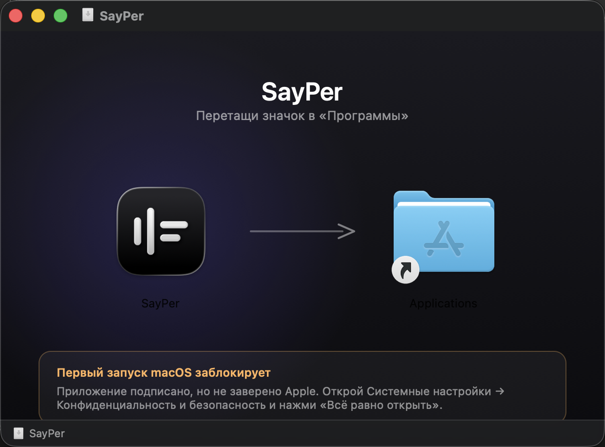
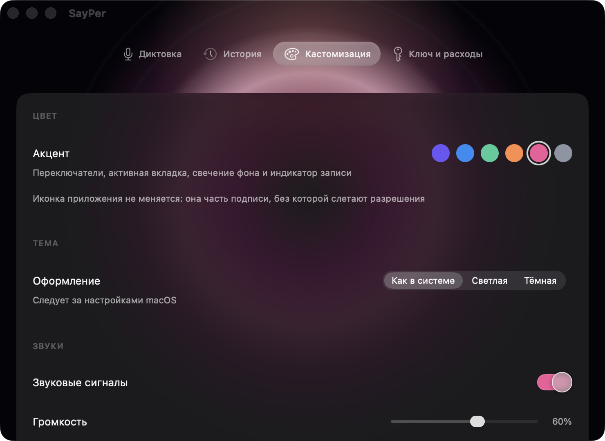

# SayPer

[English](README.md) · **Русский**

Зажал клавишу, сказал, отпустил — текст появился там, где стоит курсор.

Диктовка для macOS, живёт в строке меню. Записывает голос, отправляет в OpenAI Whisper и вставляет расшифровку в то приложение, где ты печатал. Окна нет, в Dock не висит.


## Что нужно

- **macOS 26 или новее.** Собрано под SDK macOS 26 и использует то, чего в прежних версиях нет.
- **Apple Silicon.** Сборка только arm64, на Intel не пойдёт.
- **Свой ключ OpenAI.** Расшифровка стоит около $0.006 за минуту речи — примерно 36 центов за час диктовки. Платишь напрямую OpenAI.

## Установка

1. Скачай `.dmg` из [релизов](https://github.com/grisha123invent-official/SayPer/releases).
2. **Перетащи SayPer в «Программы».** Не запускай прямо из образа или из «Загрузок»: оттуда macOS запускает копию из случайной папки только для чтения, и выданные разрешения не сохранятся.
3. **Первый запуск macOS заблокирует.** Приложение подписано, но не заверено Apple — для этого нужно платное членство в Developer Program. Открой **Системные настройки → Конфиденциальность и безопасность**, пролистай вниз и нажми **«Всё равно открыть»**.



Правый клик → «Открыть» больше не работает: Apple убрала этот обход в свежих версиях macOS. Только через системные настройки.

## Первый запуск

Мастер проведёт по всему, что нужно:

- **Микрофон** — без него записывать нечего.
- **Универсальный доступ** и **Мониторинг ввода** — два разных разрешения, нужны оба. Первое позволяет вставлять текст в чужие окна, второе — видеть горячую клавишу, пока работаешь в другой программе. Выдать их себе приложение не может, переключатели живут в системных настройках. Мастер замечает их сам, как только включишь: ни перезапуска, ни кнопки «я включил».
- **Ключ OpenAI** — создаётся на [platform.openai.com](https://platform.openai.com/api-keys). Показывается один раз, копируй сразу.

## Как пользоваться

Зажми сочетание, говори, отпусти. Текст встанет туда, где курсор.

- **Esc** прерывает что угодно: и запись, и ожидание ответа.
- Держать клавишу неудобно — включи режим **«нажал-нажал»** в разделе «Диктовка». Забытая запись остановится сама через пять минут, и текст ляжет в буфер, а не в случайное поле.
- Сочетание любое, включая одиночные модификаторы. Левые и правые клавиши различаются.
- Если хоткей состоит только из модификаторов, обычная клавиша во время записи её отменяет — так привычные шорткаты продолжают работать.

## Что ещё умеет



- **История** расшифровок, хранится локально. Любую можно скопировать или вставить заново.
- **Расходы** — оценка потраченного у OpenAI по дням и месяцам.
- **Приглушение звука** — музыка и видео лезут в микрофон и портят расшифровку, поэтому на время записи звук компьютера убавляется или выключается, а потом возвращается.
- **Словарь** — имена и термины, которые модель начинает узнавать.
- **Причёсывание** — необязательный второй проход: пунктуация и слова-паразиты.
- **Оформление** — шесть акцентных цветов, светлая/тёмная/системная тема, звуки по событиям с ползунком громкости.

## Приватность

- Звук уходит в **OpenAI** и больше никуда. Отправляется только на время расшифровки, на диске не остаётся.
- Ключ лежит на твоём маке — в связке ключей, а если она недоступна локально подписанному приложению, то в файле с правами `0600` в Application Support.
- История и расходы хранятся локально, в `~/Library/Application Support/SayPer`.
- Никакой телеметрии, аналитики, отчётов о сбоях и наших серверов.

Если отправлять звук в OpenAI неприемлемо — `Transcriber` это один файл, вместо него ставится локальный `whisper.cpp`.

## Обновления

Автообновления пока нет. Новые версии выходят релизами здесь — скачиваешь и заменяешь.

Разрешения переживают обновление: все сборки подписаны одним сертификатом.

## Сборка из исходников

Нужны только Command Line Tools, Xcode не требуется.

```bash
./build.sh          # собрать в dist/
./build.sh install  # собрать, поставить в /Applications и запустить
./build.sh dmg      # собрать образ
```

Устройство, подпись и разбор проблем — в [docs/development.md](docs/development.md).

## Состояние

Бета. Работает и используется каждый день, шероховатости ожидаемы. Замечания и идеи приветствуются.
